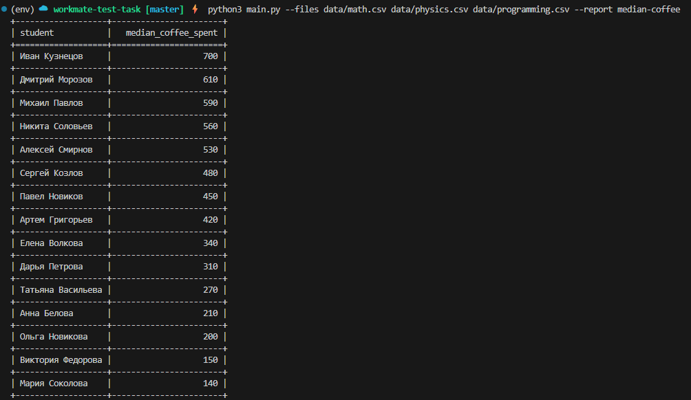

# Использование
```bash
python3 main.py --files data/math.csv --report median-coffee
```
# Параметры
- `--files`: путь к файлу или файлам .csv для их обработки
- `--report`: тип отчёта (на данный момент только `median-coffee`)

# Демонстрация работы скрипта


# Структура проекта
```sh
.
├── README.md                    
├── main.py                      # Точка входа
├── requirements.txt             # Зависимости проекта
├── ruff.toml                    # Конфигурация линтера
├── app/                         # Основной пакет приложения
│   ├── __init__.py
│   ├── loader/                  # Загрузка данных из csv файлов
│   │   ├── __init__.py
│   │   └── models.py            # Модели данных
│   └── reports/                 # Отчеты
│       ├── __init__.py
│       ├── base.py              # Базовый класс отчета
│       └── median_coffee.py     # Отчет о тратах на кофе
├── data/                        # Примеры данных
│   ├── math.csv
│   ├── physics.csv
│   └── programming.csv
└── tests/                       # Тесты
    ├── test_components.py
    ├── test_loader.py
    └── test_reports.py

```

# Запуск тестов
```sh
python3 -m pytest
```